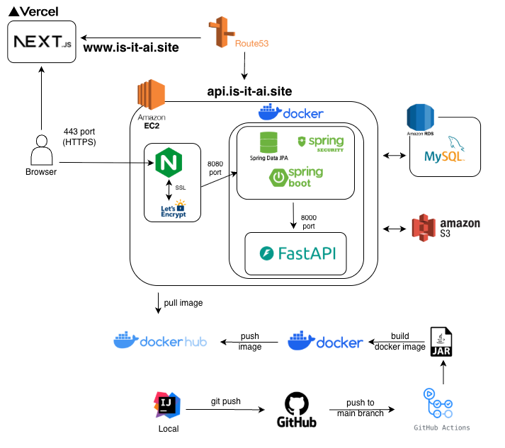
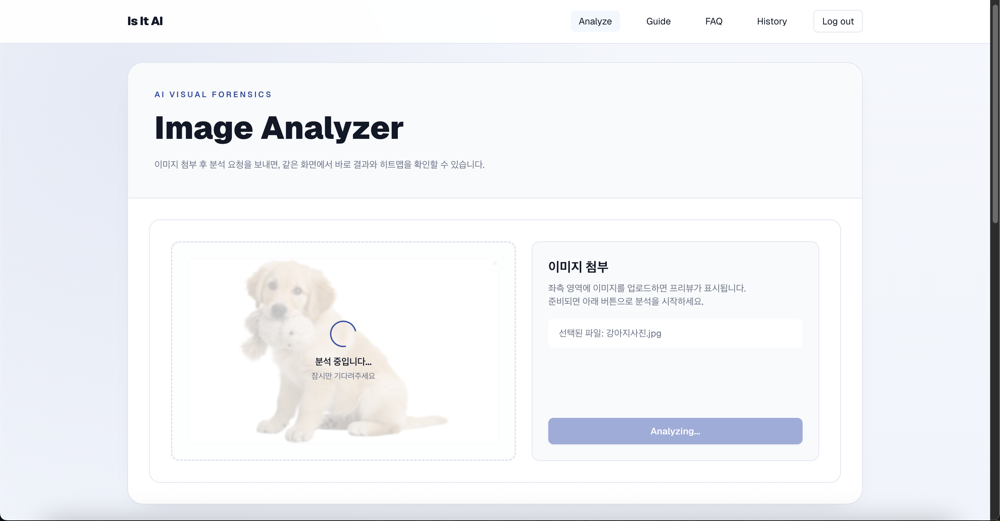
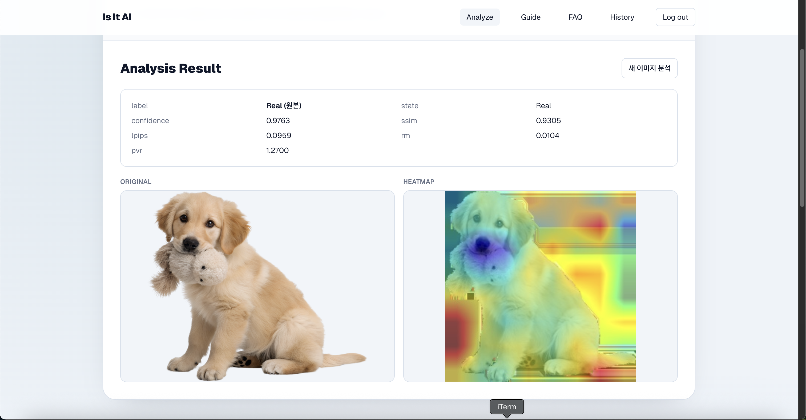
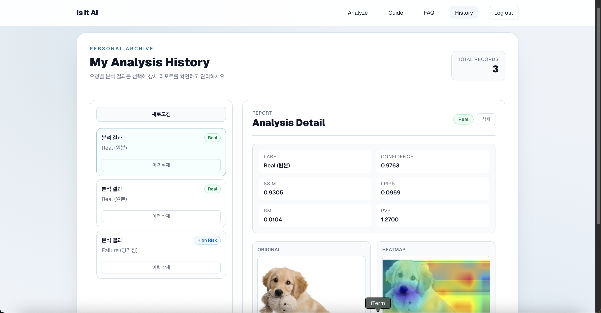

# Is It AI

> 서비스 확인하기: [is-it-ai.site](https://is-it-ai.site)

**Is It AI**는 업로드된 이미지의 위·변조 여부를 분석하고, 히트맵(Heatmap) 시각화 결과와 함께 신뢰 지표(Confidence 및 다양한 정량 지표)를 제공하는 서비스입니다.

---

## Key Features

- **Analyzing**: 단일 이미지에 대한 분석 지표와 직관적인 히트맵 제공
- **User History**: JWT 기반 인증으로 사용자별 히스토리 관리 및 상세 조회/삭제
- **Analysis Metrics**: 단순 판별을 넘어 **Confidence, SSIM, LPIPS, RM, PVR** 등 지표 제공
- **Visual Feedback**: 원본 대비 **히트맵 이미지 제공**으로 위변조 의심 영역 시각화

---

## Main System Flow

서비스의 메인 기능인 분석 처리를 위해 다음 파이프라인으로 구성했습니다.

1. **Upload**  
   사용자가 업로드한 이미지를 Spring Boot가 수신한 뒤 AWS S3에 저장합니다.

2. **Inference**  
   Spring 서버가 S3 URL을 FastAPI로 전달하여 **추론 요청**을 수행합니다.

3. **Analysis**  
   FastAPI 서버에서 **모델 추론 및 히트맵 생성**을 수행하고, 결과 이미지를 S3에 업로드합니다.

4. **Persistence**  
   Spring 서버가 분석 결과(Confidence, SSIM 등)를 DB에 기록하고 클라이언트에 응답합니다.

---

## Service Architecture



- **Frontend**: Vercel에서 Next.js 애플리케이션을 정적 호스팅하며 자동 배포
- **Backend**: AWS EC2에서 Docker Compose로 Spring Boot와 FastAPI 추론 서버를 함께 운영
- **Reverse Proxy**: Nginx를 통해 HTTPS(SSL) 적용 후 프록시 라우팅 수행
- **Storage & DB**: AWS S3에 모델 가중치 및 이미지 파일 저장, MySQL에 사용자/분석 이력 저장

---

## Deployment & CI/CD

- Frontend: Vercel Git Hook 기반 자동 배포

- Backend: GitHub Actions로 Docker Image 빌드 후 EC2 자동 배포

---

## Service Screenshots

1. 이미지 분석 중



2. 분석 결과



3. 분석 이력



---

## Tech Stack

| 영역 | 사용 기술 |
| --- | --- |
| Frontend |     |
| Backend |     |
| AI Server |     |
| Infra / DB |        |

---

## Project Structure

```text
.
├── .github/              # GitHub Actions 워크플로우
├── frontend-nextjs/      # 사용자 UI 및 API 통신
├── backend-spring/       # 비즈니스 로직 및 인증 처리
├── ai-server/            # AI 모델 추론 및 시각화 서버
└── docker-compose.yml    # 전체 서비스 컨테이너 오케스트레이션
```
